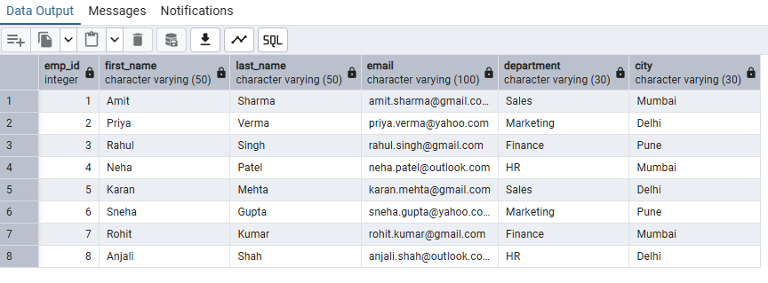

# Day 4 - SQL String Functions

## Overview

This project is part of my SQL learning journey.

In this exercise, I practiced different SQL String Functions using an Employee dataset in PostgreSQL.

## Dataset


## String Functions Practiced

### UPPER()

Converts text into uppercase letters.

```sql
SELECT UPPER(first_name)
FROM employee;
```

### LOWER()

Converts text into lowercase letters.

```sql
SELECT LOWER(first_name)
FROM employee;
```

### LENGTH()

Returns the number of characters in a string.

```sql
SELECT LENGTH(first_name), first_name
FROM employee;
```

### SUBSTRING()

Extracts part of a string.

```sql
SELECT SUBSTRING(city,1,3), city
FROM employee;
```

### CONCAT()

Combines multiple strings into one string.

```sql
SELECT CONCAT(first_name,' ',last_name)
FROM employee;
```

### REPLACE()

Replaces specified text with another text.

```sql
SELECT REPLACE(city,'Pune','Bengluru')
FROM employee;
```

### TRIM()

Removes leading and trailing spaces.

```sql
SELECT LENGTH('  khushi  '),
       LENGTH(TRIM('  khushi  '));
```

## Skills Practiced

* Working with string functions
* Understanding text manipulation in SQL

## Tools Used

* PostgreSQL
* pgAdmin

## Learning Outcome

Through this practice, I learned how to manipulate and format text data using SQL String Functions, which are commonly used in data cleaning and data analysis tasks.
